## Object_detection_chatbot
[](https://travis-ci.org/joemccann/dillinger)

This project involves using object detection to analyse the changes in crowd, vehicle and flight traffic on traffic-camera and aerial images to understand the urban impact of COVID-19. A database of pre-detected images is integrated with a Webex Teams Chatbot which aims to educate and inform the public on COVID-19 related insights.

## Table of Content
- [Motivation](#motivation)
- [Installation](#installation)
  * [Step 1: Creating a virtual environment](#Step 1)
  * [Step 2: Install webexteamssdk](#step-2--install-webexteamssdk)
  * [Step 3: Create your bot on Cisco Webex](#step-3--create-your-bot-on-cisco-webex)
  * [Step 4: Setup ngrok and env variables](#step-4--setup-ngrok-and-env-variables)
  * [Step 5: Other requirements](#step-5--other-requirements)
  * [Step 6: Run the bot](#step-6--run-the-bot)
- [Features](#Features)
  * [Object detection feature](#object-detection-feature)
  * [Aerial object detection feature](#aerial-object-detection-feature)
- [Limitations and Future Improvements](#limitations-and-future-improvements)
  * [Accuracy](#accuracy)
  * [Speed](#speed)
  * [Direct-integration of detection algorithms](#direct-integration-of-detection-algorithms)
- [Credits](#credits)

<small><i><a href='http://ecotrust-canada.github.io/markdown-toc/'>Table of contents generated with markdown-toc</a></i></small>


## Motivation
Given the impact this recent pandemic has had on our world, we decided to create a chatbot to help both the common public and decision makers alike through the features we have implemented.

## Installation
The following dependencies need to be installed before running the chatbot. I managed to execute the chatbot using the Anaconda Prompt on Windows OS, but feel free to use Linux/Ubuntu whichever you prefer. You would need to have the following installed: 
- virtualenv 
- python3 
- [ngrok](https://ngrok.com/download)

### Step 1: Creating a virtual environment 
Initialize the virtual environment by running the following commands in your local terminal

```sh
virtualenv venv
source venv/bin/activate
```
### Step 2: Install webexteamssdk
You now have your virtual environment set up. We will now need the webexteamssdk module to run the chatbot in python.

```sh
pip install webexteamsssdk
```
### Step 3: Create your bot on Cisco Webex
If you have already created your bot, move on to step 4 with your **access token**. Else, create your Webex Account and create your bot. You will be given an access token. Be sure to save it somewhere safe. We will need it in step 4.

### Step 4: Setup ngrok and env variables
In a different terminal, navigate to the folder where you have the ngrok placed and run the following command.
```sh
ngrok http 5000
```
You should see a url of _https://...ngrok.io_ format. Copy it and export it to the env variables. 
Also, export the port used for ngrok. In this case, we used port 5000. 
```sh
export WEBHOOK_URL=https://...ngrok.io
export PORT=5000
```
Finally, take your bot's access token and place it in your environment variable as WEBEX_TEAMS_ACCESS_TOKEN.

### Step 5: Other requirements

```sh
pip install -r requirements.txt
```

### Step 6: Run bot

We can now run the bot using the main python file ***test.py*.
```sh
python ./test.py
```
## Features
We will cover these additional features:
* Object detection feature
* Aerial object detection feature

The first three features were previously covered [here](https://github.com/shawnlim97/CiscoCovidBot-Final-).
### Object detection feature
The **Object detection feature** is activated using the */detection* keyword command with the card as shown. 

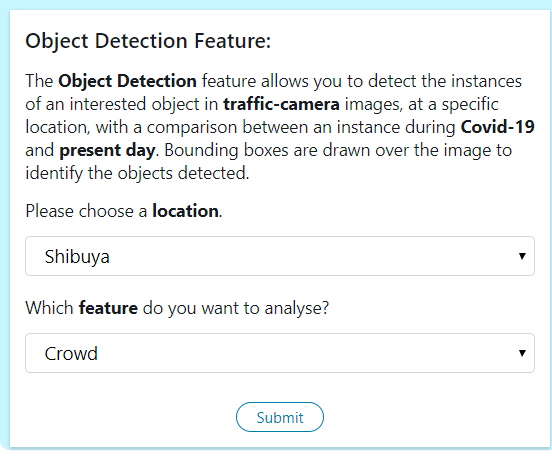

Once submitted, the bot will access the shared dir to obtain the necessary pre-processed images and secondary data for analysis.

Example **crowd** detection in **Shibuya** response:

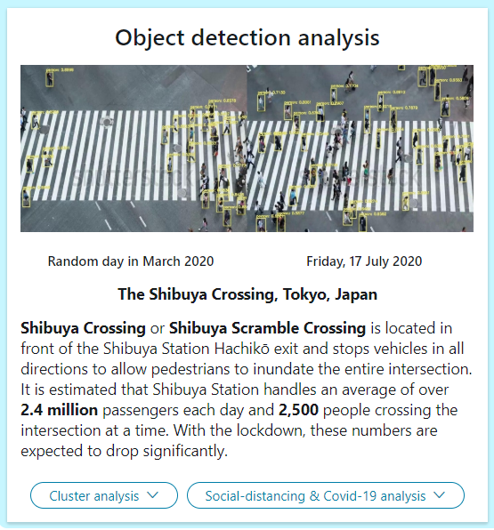

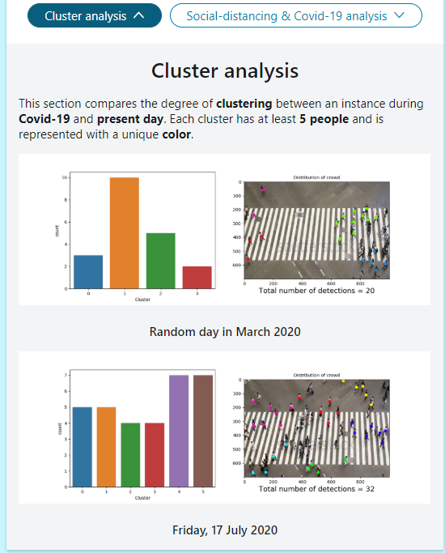

*Cluster analysis of crowd detections*

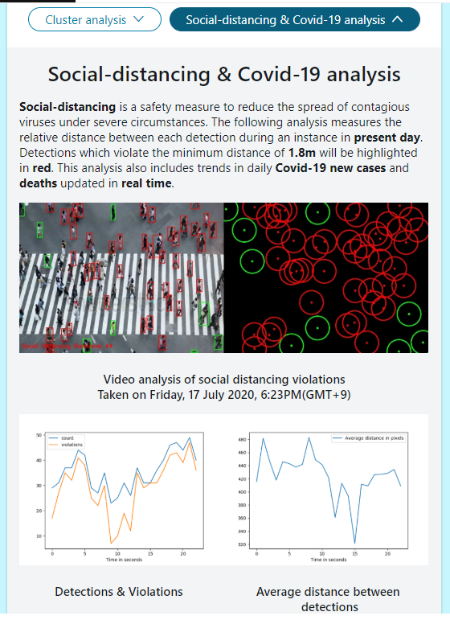

*Social-distancing and Covid-19 data analysis*

### Aerial object detection feature
The **Aerial object detection feature** is activated using the */aerial-detection* keyword command with the card as shown. 

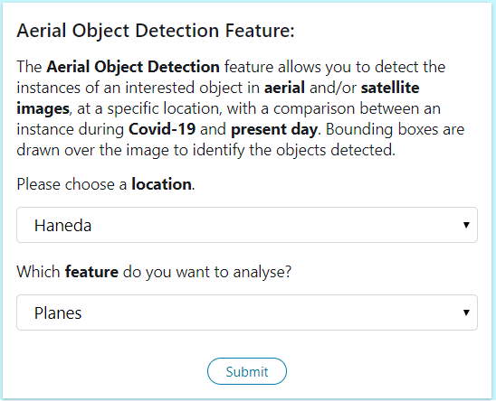

Once submitted, the bot will access the shared dir to obtain the necessary pre-processed images and secondary data for analysis.

Example of aerial **planes** detection in **Haneda** response:

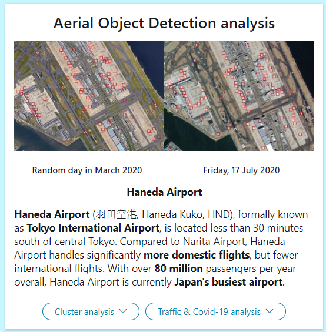

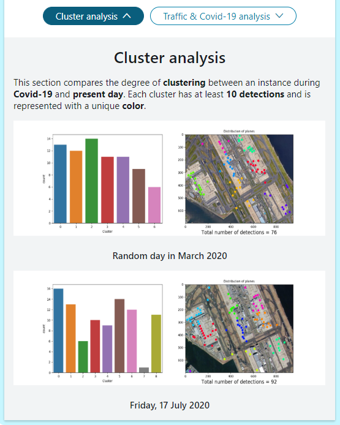

*Cluster Analysis of plane detections*

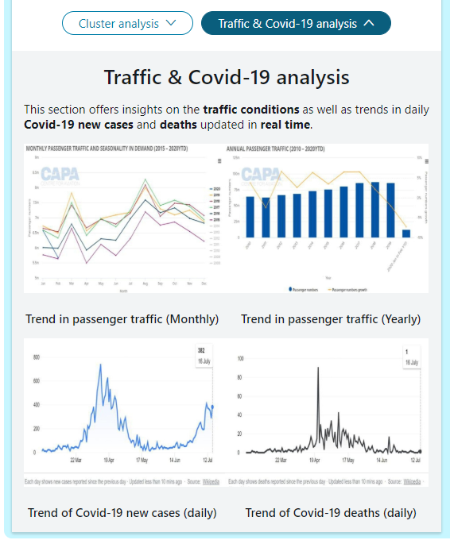

*Passenger traffic and Covid-19 data analysis*

## Limitations and Future Improvements

Due to the shortage of time, the current bot is not built to perform detections automatically on new images. Currently, this is a proof of concept demonstrated using pre-processed images. The following areas can be improved to improve the useability of the object detection features. 

### Accuracy
The following aspects can be reviewed to increase the accuracy of the detection algorithms on traffic-camera view images.

#### 1. Limited viewing angles and zoom

The Yolov3 detection algorithm utilised in this project are best used for specific angles and zoom. To accommodate traffic-camera view images and footage taken at multiple viewing points, we have to transform the images to a fixed viewing angle to conduct consistent analysis.

During my research, I discovered that using homography such as OpenCV's [Perspective Transform](https://www.pyimagesearch.com/2014/08/25/4-point-opencv-getperspective-transform-example/) could resolve this issue. However, due to its high complexity and the lack of time, I was unable to achieve this objective. Instead, I managed to transform detected video frames to make them easier to analyse social distancing violations. Below is an example of this execution.

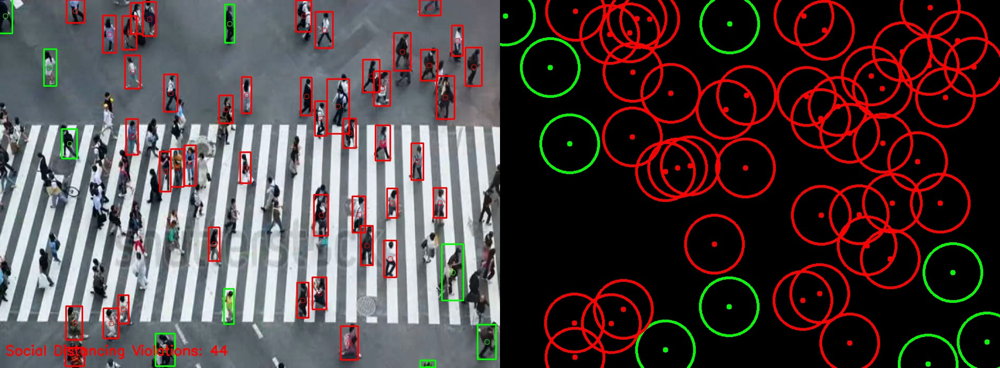

*An attempt to transform the video frame (left) to a more analytical perspective (right) where each overlapping circle indicates a violation of social distancing.* 

#### 2. False Negatives

The biggest flaw of the Yolov3 algorithm is that it is unable to identify objects whenever there is severe overcrowding.

Below are some examples that illustrate this problem. Re-training the model with images of similar nature could help to solve the issue of missing detections/false negatives.

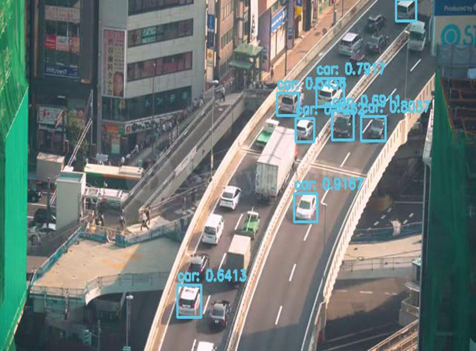

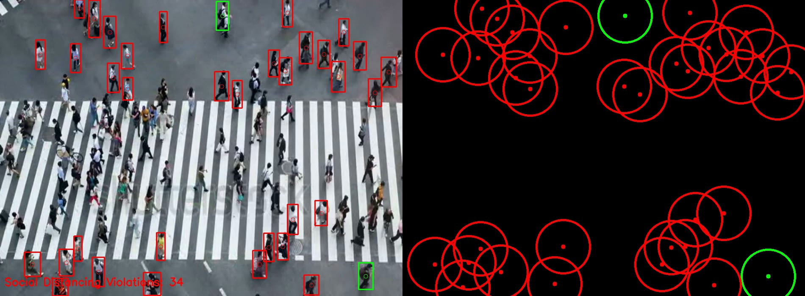

*False negatives are observed due to the problem of overcrowding.*

### Speed

The chatbot currently takes between 40 to 50 seconds to generate the response. This is because the process mainly involves embedding 8-10 images from the local PC to the output response card.

The speed of the response depends on the number of pixels required to be embedded on the response card. Thus, there is a need to balance between providing a fast response and having sufficient visualisations to gain understandable insights on the impact caused by Covid-19.

### Direct integration of detection algorithms

Integrating the detection algorithms is a difficult task for the following reasons. 

#### 1. Slower response time 

In addition to responding to the card requests, direct integration will result in a longer time needed to pre-process raw images, and generate the detections and supporting diagrams.

#### 2. A robust architecture is needed to support multiple detection algorithms

No single detection algorithm is able to perform detections on all types of images accurately. Due to the high complexity, I was unable to merge the detection algorithms or embed them in the main chatbot python file. More research has to be done to determine the feasibility of this approach.

## Credits

**CiscoDevNet's webexteamssdk**, https://github.com/CiscoDevNet/webexteamssdk

**YOLOV3 by Adrian Rosebruck**
1. Yolo Object Detection with OpenCV, https://www.pyimagesearch.com/2018/11/12/yolo-object-detection-with-opencv/

2. OpenCV Social Distancing Detector, https://www.pyimagesearch.com/2020/06/01/opencv-social-distancing-detector/

**Bob Hammell, rhammell@github.com**

1. Planesnet-detector, https://github.com/rhammell/planesnet-detector

**Ibrahim, Andhrimnirr@github.com**

1. Pre-trained weights, https://drive.google.com/file/d/1UWzucDKuuvtbyTJDjZ0qKtFATnPbp95H/view

2. Aerial-Object-Detection-With-YOLO, https://github.com/Andhrimnirr/Aerial-Object-Detection-With-Yolo
 

